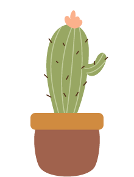

# HappyPlants

A Flutter plant care tracker with animated SVG illustrations, an AI plant advisor, a per-plant care calendar, and a global calendar view. Keep your plants happy by logging waterings and fertilizing, uploading photos, and watching them sway when they're well cared for.

<br>

<p align="center">
  
</p>

<br>

## Features

- **Plant library** — add as many plants as you want, each with a name, species, watering schedule, and illustration
- **Care logging** — one-tap logging for watering and fertilizing with optional emoji, color, and notes; timestamps stored locally
- **Overdue indicators** — plant cards show days until next watering or a red "Overdue!" badge when a plant needs attention
- **Animated illustrations** — 7 hand-crafted SVG plants sway gently when happy; droop slowly when care is overdue
- **Plant picker** — a scrollable 3-column grid previewing all illustrations; selected plant animates live, others stay still
- **Per-plant care calendar** — horizontal scrollable day grid showing logged care events and upcoming scheduled waterings; tap to log, long-press for edit/delete radial menu; supports rescheduling the watering cycle start date
- **Photo system** — upload photos of your plants; photos appear as thumbnails on the day they were taken in both the per-plant calendar and the global calendar
- **Global calendar tab** — month-grid view aggregating care logs and photos across all plants; tap any day to see an inline panel with events, scheduled waterings, and photo thumbnails; tap a photo to open a full-screen viewer
- **Watering schedule on global calendar** — opt individual plants in via a toggle on their detail screen; projected future waterings appear as dashed green chips; tap to reschedule the cycle start date
- **AI plant advisor** — in-app chat powered by Gemini that understands your plant collection and can add plants, log care, update details, and delete plants on your behalf via function calling
- **Fully offline** — all data stored on-device with SQLite; AI chat requires a network connection

## Tech Stack

| Concern | Solution |
|---------|----------|
| Framework | Flutter 3 / Dart |
| State management | `setState` (no external package) |
| Local storage | SQLite via [`sqflite`](https://pub.dev/packages/sqflite) |
| SVG rendering | [`flutter_svg`](https://pub.dev/packages/flutter_svg) |
| Image picking | [`image_picker`](https://pub.dev/packages/image_picker) |
| AI chat | Gemini REST API (direct `http` calls, SSE streaming) |
| Test DB (in-memory) | [`sqflite_common_ffi`](https://pub.dev/packages/sqflite_common_ffi) |

## Project Structure

```
lib/
├── models/
│   ├── plant.dart               # Plant data class — schedule toggle, copyWith, toMap/fromMap
│   ├── care_log.dart            # CareLog + CareType enum (watering/fertilizing)
│   ├── plant_photo.dart         # PlantPhoto — filePath, dateTaken, isCover, notes
│   ├── plant_definition.dart    # PlantDefinition + PlantPart: SVG layout &
│   │                            #   animation parameters for each illustration
│   └── plant_images.dart        # Key/label list used by the plant picker
│
├── repositories/
│   ├── plant_repository.dart    # CRUD for the plants table
│   ├── care_log_repository.dart # CRUD + getAll() + update() for care_logs
│   └── plant_photo_repository.dart # CRUD + getAll() + cover management for plant_photos
│
├── screens/
│   ├── home_screen.dart         # Two-tab layout (plants / global calendar) via BottomNavigationBar + IndexedStack
│   ├── add_plant_screen.dart    # Form: name, species, interval, illustration
│   ├── plant_detail_screen.dart # Care history, per-plant calendar, photo upload,
│   │                            #   edit/delete, schedule-on-calendar toggle
│   ├── calendar_screen.dart     # Global month-grid calendar with inline day panel
│   └── chat_screen.dart         # AI chat with Gemini — streaming, function calling
│
├── widgets/
│   ├── plant_widget.dart        # Animated SVG plant (or drawn fallback)
│   ├── plant_card.dart          # Home list tile with overdue badge
│   ├── plant_picker.dart        # Illustration selector grid
│   └── plant_care_calendar.dart # Horizontal day-grid: care row + photo row,
│                                #   tap/long-press actions, radial menu, schedule dots
│
├── services/
│   └── gemini_service.dart      # Gemini REST client — model auto-detection,
│                                #   SSE streaming, multi-turn history, function calling
│
├── routes/
│   └── circular_reveal_route.dart # Custom page transition used for chat screen
│
└── theme/
    └── app_theme.dart           # AppTheme + AppColors — single source of truth for colours

assets/
└── images/plants/
    ├── plant_01/   # Vine          (3 SVG parts)
    ├── plant_02/   # Snake Plant   (8 SVG parts)
    ├── plant_03/   # Cactus        (2 SVG parts)
    ├── plant_05/   # Pancake Plant (5 SVG parts)
    ├── plant_07/   # Trailing      (2 SVG parts)
    ├── plant_14/   # Monstera      (4 SVG parts)
    └── plant_15/   # Tea Plant     (1 SVG part)
```

## Calendar System

### Per-plant calendar (`PlantCareCalendar`)

A horizontally scrollable grid that lazy-loads 14-day chunks as you scroll. Each day column has two rows:

| Row | Label | Content |
|-----|-------|---------|
| Care | leaf icon | All logged care events for that day — tap to quick-log or delete, long-press for radial edit/delete menu |
| Photos | camera icon | Thumbnails of photos taken that day — tap to open full-screen viewer |

Future scheduled waterings appear as dashed green cells with a water-drop icon. Tapping a scheduled cell offers a "Reschedule cycle" option that shifts the watering cycle anchor date.

Today's column is outlined in olive. The grid auto-scrolls to today on first load.

### Global calendar (`CalendarScreen`)

A month-grid view (Google Calendar style) accessed from the second bottom-nav tab. Tapping any day populates an inline panel below the grid with three sections:

- **Events** — care logs from all plants, with edit and delete actions
- **Scheduled** — projected future waterings for opted-in plants; tap to reschedule
- **Photos** — 80×80 thumbnails with plant name labels; tap to open a full-screen PageView viewer

The calendar auto-refreshes when the tab is activated and has a manual refresh button in the header.

To show a plant's projected schedule on the global calendar, enable the toggle next to "Care Schedule" on the plant's detail screen.

## Animation System

Each plant illustration is described by a `PlantDefinition` — a canvas size and a list of `PlantPart` entries. Every part carries:

| Field | Purpose |
|-------|---------|
| `asset` | Path to the SVG file |
| `left` / `bottom` | Position on the canvas (bottom-left origin) |
| `width` / `height` | Rendered size |
| `happyAmplitude` | Peak rotation in radians when happy; ×0.3 when sad |
| `phaseOffset` | `0.0–1.0` stagger so leaves don't move in sync |
| `baseAngle` | Constant rotation offset applied before sway |
| `swayAlignment` | Pivot point — `BottomCenter` (default), `BottomLeft`, or `BottomRight` |

Sway formula applied each frame:

```
angle = baseAngle + sin(controller.value × 2π + phaseOffset × 2π) × amplitude
```

- Happy plants: 4 s cycle, full amplitude
- Sad plants: 8 s cycle, amplitude × 0.3
- `isStatic: true`: renders at `baseAngle` only (used in the picker for unselected tiles)

## AI Chat

`GeminiService` auto-detects the best available Gemini model (`gemini-2.5-flash` → `gemini-2.0-flash` → …) and streams responses via SSE. The assistant has access to four function-calling tools:

| Tool | Effect |
|------|--------|
| `add_plant` | Inserts a new plant row |
| `update_plant` | Updates name, species, interval, or notes |
| `delete_plant` | Removes a plant and its care logs |
| `log_care` | Inserts a care log and updates last care date |

The API key defaults to a hardcoded value and can be overridden at build time:

```bash
flutter run --dart-define=GEMINI_API_KEY=<your_key>
```

## Database Schema

Current version: **6**

### `plants`

| Column | Type | Notes |
|--------|------|-------|
| `id` | `INTEGER PRIMARY KEY AUTOINCREMENT` | |
| `name` | `TEXT NOT NULL` | |
| `species` | `TEXT NOT NULL` | |
| `watering_interval_days` | `INTEGER NOT NULL` | |
| `last_watered_date` | `TEXT` | ISO 8601 |
| `last_fertilized_date` | `TEXT` | ISO 8601 |
| `notes` | `TEXT` | optional |
| `plant_key` | `TEXT` | illustration key, e.g. `plant_02` |
| `schedule_on_calendar` | `INTEGER NOT NULL DEFAULT 0` | 1 = show projected waterings on global calendar |

### `care_logs`

| Column | Type | Notes |
|--------|------|-------|
| `id` | `INTEGER PRIMARY KEY AUTOINCREMENT` | |
| `plant_id` | `INTEGER NOT NULL` | FK → `plants.id` |
| `type` | `TEXT NOT NULL` | `'watering'` or `'fertilizing'` |
| `date` | `TEXT` | ISO 8601 |
| `notes` | `TEXT` | optional |
| `emoji` | `TEXT` | optional display emoji |
| `color` | `TEXT` | optional hex color, e.g. `#4A9BE8` |

### `plant_photos`

| Column | Type | Notes |
|--------|------|-------|
| `id` | `INTEGER PRIMARY KEY AUTOINCREMENT` | |
| `plant_id` | `INTEGER NOT NULL` | FK → `plants.id` |
| `file_path` | `TEXT NOT NULL` | absolute path to image on device |
| `date_taken` | `TEXT NOT NULL` | ISO 8601 |
| `is_cover` | `INTEGER NOT NULL DEFAULT 0` | 1 = cover photo for plant card |
| `notes` | `TEXT` | optional |

## Getting Started

### Prerequisites

- [Flutter SDK](https://docs.flutter.dev/get-started/install) ≥ 3.0
- Android SDK or Xcode (for device/emulator)

### Run

```bash
git clone https://github.com/ethancs13/HappyPlants-app.git
cd HappyPlants-app
flutter pub get
flutter run
```

### Test

```bash
flutter test          # all unit + widget tests
flutter analyze       # static analysis
```

### Build

```bash
# Android APK
flutter build apk

# Android App Bundle (Play Store)
flutter build appbundle

# iOS
flutter build ios
```

## License

MIT License

Copyright (c) 2026 ethancs13

Permission is hereby granted, free of charge, to any person obtaining a copy
of this software and associated documentation files (the "Software"), to deal
in the Software without restriction, including without limitation the rights
to use, copy, modify, merge, publish, distribute, sublicense, and/or sell
copies of the Software, and to permit persons to whom the Software is
furnished to do so, subject to the following conditions:

The above copyright notice and this permission notice shall be included in all
copies or substantial portions of the Software.

THE SOFTWARE IS PROVIDED "AS IS", WITHOUT WARRANTY OF ANY KIND, EXPRESS OR
IMPLIED, INCLUDING BUT NOT LIMITED TO THE WARRANTIES OF MERCHANTABILITY,
FITNESS FOR A PARTICULAR PURPOSE AND NONINFRINGEMENT. IN NO EVENT SHALL THE
AUTHORS OR COPYRIGHT HOLDERS BE LIABLE FOR ANY CLAIM, DAMAGES OR OTHER
LIABILITY, WHETHER IN AN ACTION OF CONTRACT, TORT OR OTHERWISE, ARISING FROM,
OUT OF OR IN CONNECTION WITH THE SOFTWARE OR THE USE OR OTHER DEALINGS IN THE
SOFTWARE.
